# 📊 Systematic Literature Review — Analysis Report

**Generated:** 2026-07-12 16:59
**Dataset:** 995 papers (2015–2026)
**Topic:** GNSS-Denied Localization for Autonomous Vehicles

---

## 1. Summary Statistics

| Metric | Value |
|--------|-------|
| Total papers analysed | 995 |
| Year range | 2015–2026 |
| Unique publication venues | 572 |
| Papers with sensor classification | 776 (78.0%) |
| Papers with algorithm classification | 535 (53.8%) |
| Papers with application classification | 995 (100.0%) |
| Papers with environment classification | 667 (67.0%) |
| Papers referencing benchmark datasets | 84 (8.4%) |
| Total citations | 11,574 |
| Average citations per paper | 11.6 |
| Most cited paper | 682 citations |

## 2. Publication Trends (RQ — Context)

### Papers per Year

| Year | Papers | Cumulative |
|------|--------|------------|
| 2015 | 24 | 24 |
| 2016 | 33 | 57 |
| 2017 | 33 | 90 |
| 2018 | 51 | 141 |
| 2019 | 81 | 222 |
| 2020 | 72 | 294 |
| 2021 | 63 | 357 |
| 2022 | 72 | 429 |
| 2023 | 108 | 537 |
| 2024 | 136 | 673 |
| 2025 | 225 | 898 |
| 2026 | 97 | 995 |

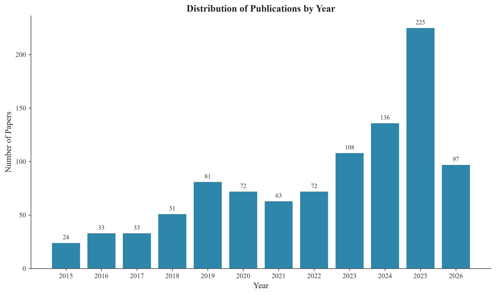

## 3. Sensor Modality Analysis (RQ1)

### Sensor Usage Frequency

| Sensor | Count | Percentage |
|--------|-------|------------|
| Camera | 402 | 40.4% |
| IMU | 333 | 33.5% |
| GNSS/GPS | 321 | 32.3% |
| Radar | 194 | 19.5% |
| LiDAR | 187 | 18.8% |
| Monocular | 91 | 9.1% |
| WiFi | 72 | 7.2% |
| UWB | 68 | 6.8% |
| Wheel Encoder | 51 | 5.1% |
| RGB-D | 32 | 3.2% |
| BLE/Bluetooth | 27 | 2.7% |
| Stereo | 23 | 2.3% |
| Ultrasonic | 21 | 2.1% |
| Magnetometer | 15 | 1.5% |
| Barometer | 11 | 1.1% |
| DVL | 8 | 0.8% |
| Event Camera | 6 | 0.6% |
| Thermal | 2 | 0.2% |

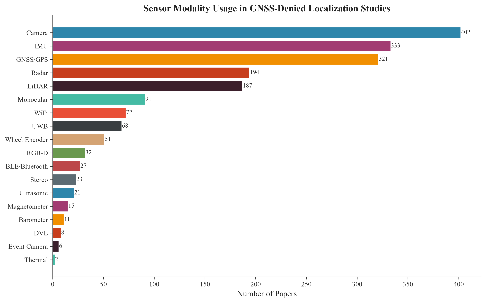

**Key Finding:** The most commonly used sensor modality is **Camera** (appearing in 402 papers, 40.4% of the corpus). 
The top three sensors are **Camera**, **IMU**, and **GNSS/GPS**.

## 4. Algorithm & Framework Analysis (RQ2)

### Algorithm Usage Frequency

| Algorithm | Count | Percentage |
|-----------|-------|------------|
| Visual-Inertial Odometry | 139 | 14.0% |
| Visual Odometry | 128 | 12.9% |
| EKF | 119 | 12.0% |
| Deep Learning | 119 | 12.0% |
| Particle Filter | 65 | 6.5% |
| Factor Graph | 45 | 4.5% |
| UKF | 27 | 2.7% |
| VINS | 26 | 2.6% |
| Optical Flow | 19 | 1.9% |
| Bundle Adjustment | 15 | 1.5% |
| ICP | 14 | 1.4% |
| LOAM | 13 | 1.3% |
| MSCKF | 10 | 1.0% |
| Pose Graph | 8 | 0.8% |
| ORB-SLAM | 7 | 0.7% |
| NDT | 7 | 0.7% |
| LIO-SAM | 2 | 0.2% |
| GTSAM | 2 | 0.2% |
| iSAM | 1 | 0.1% |

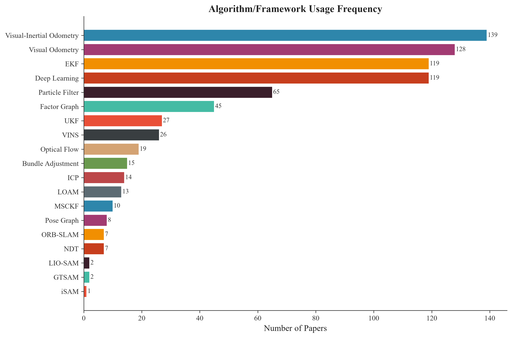

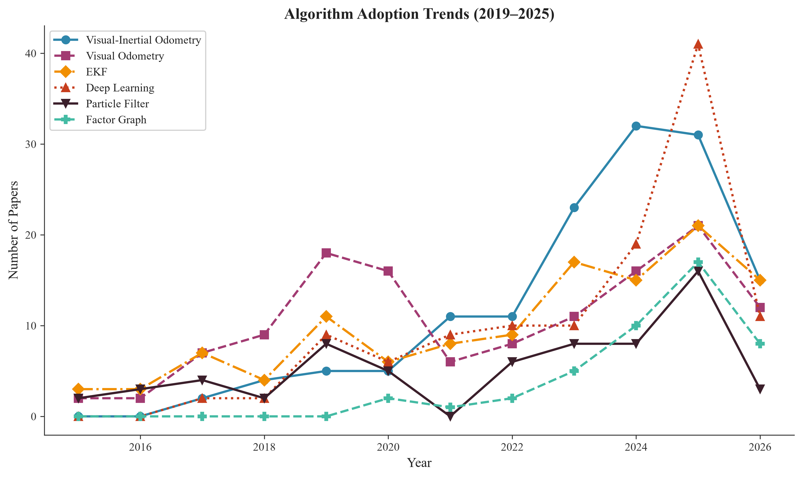

**Key Finding:** The most widely adopted algorithm/framework is **Visual-Inertial Odometry** (139 papers). 

## 5. Sensor–Algorithm Co-occurrence Analysis (RQ1 + RQ2)

### Top 20 Sensor–Algorithm Combinations

| Rank | Sensor | Algorithm | Count |
|------|--------|-----------|-------|
| 1 | GNSS/GPS | nan | 152 |
| 2 | nan | nan | 148 |
| 3 | Camera | Visual-Inertial Odometry | 138 |
| 4 | IMU | Visual-Inertial Odometry | 137 |
| 5 | Camera | Visual Odometry | 128 |
| 6 | Camera | nan | 91 |
| 7 | Radar | nan | 86 |
| 8 | IMU | nan | 79 |
| 9 | LiDAR | nan | 66 |
| 10 | IMU | EKF | 62 |
| 11 | Camera | Deep Learning | 61 |
| 12 | GNSS/GPS | EKF | 50 |
| 13 | GNSS/GPS | Visual-Inertial Odometry | 49 |
| 14 | WiFi | nan | 47 |
| 15 | IMU | Visual Odometry | 43 |
| 16 | Camera | EKF | 42 |
| 17 | IMU | Deep Learning | 39 |
| 18 | Monocular | Visual-Inertial Odometry | 38 |
| 19 | Monocular | Visual Odometry | 36 |
| 20 | UWB | nan | 32 |

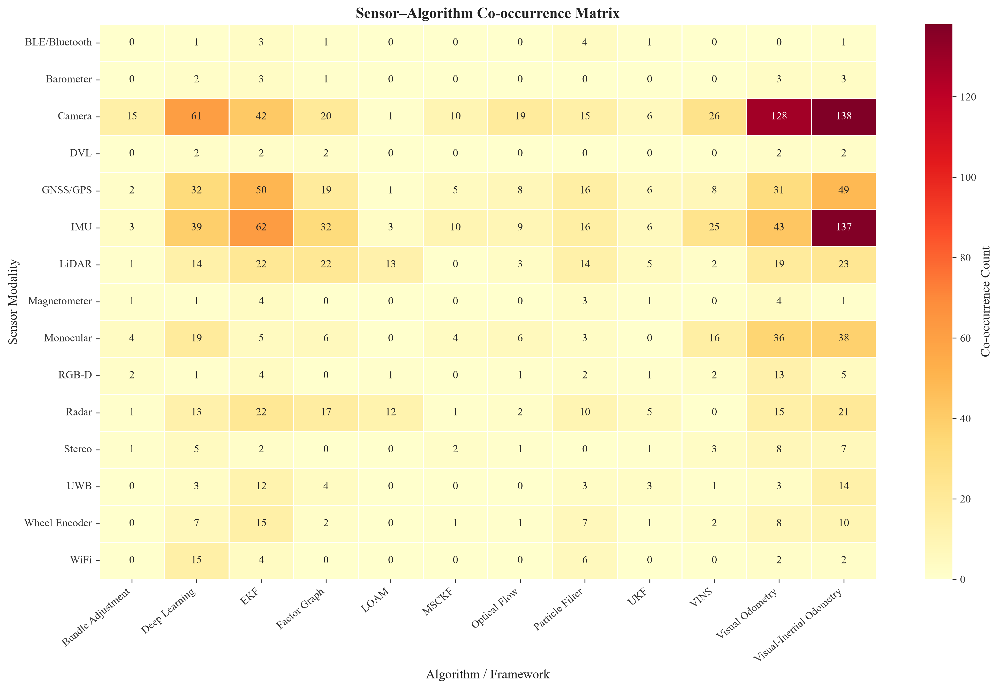

**Key Finding:** The most common sensor–algorithm combination is **GNSS/GPS + nan** (152 papers).

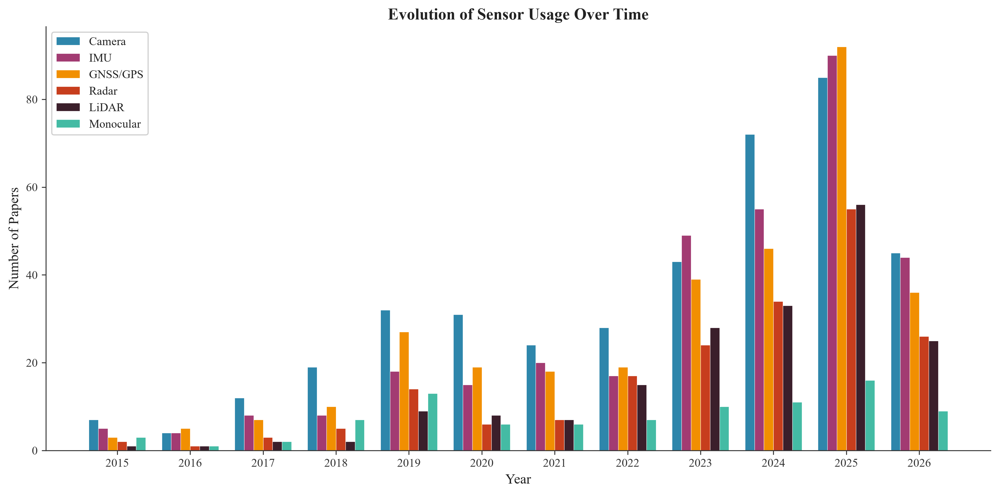

## 6. Localization Accuracy Analysis (RQ3)

Accuracy values were extracted from 44 paper abstracts.

| Statistic | Value (m) |
|-----------|-----------|
| Papers with extractable accuracy | 41 |
| Mean accuracy | 2.3742 |
| Median accuracy | 0.3600 |
| Min (best) accuracy | 0.0050 |
| Max (worst) accuracy | 20.0000 |
| Std deviation | 4.4534 |

### Accuracy by Sensor Type

| Sensor | Papers | Mean (m) | Median (m) | Best (m) |
|--------|--------|----------|------------|----------|
| UWB | 4 | 0.3332 | 0.3195 | 0.0890 |
| Radar | 6 | 0.4742 | 0.1705 | 0.0540 |
| LiDAR | 8 | 0.7476 | 0.1265 | 0.0270 |
| Camera | 12 | 1.1683 | 0.3145 | 0.0050 |
| Monocular | 4 | 1.4598 | 0.3145 | 0.0700 |
| BLE/Bluetooth | 4 | 1.4700 | 1.2600 | 0.3600 |
| IMU | 14 | 2.0041 | 0.5525 | 0.0540 |
| GNSS/GPS | 18 | 2.6491 | 0.4300 | 0.0540 |
| WiFi | 6 | 3.1817 | 1.2600 | 0.5000 |
| Ultrasonic | 3 | 3.4710 | 0.0890 | 0.0540 |
| nan | 8 | 3.6926 | 0.3300 | 0.0270 |
| Magnetometer | 2 | 4.0700 | 4.0700 | 3.0000 |
| Wheel Encoder | 2 | 6.5650 | 6.5650 | 0.0600 |

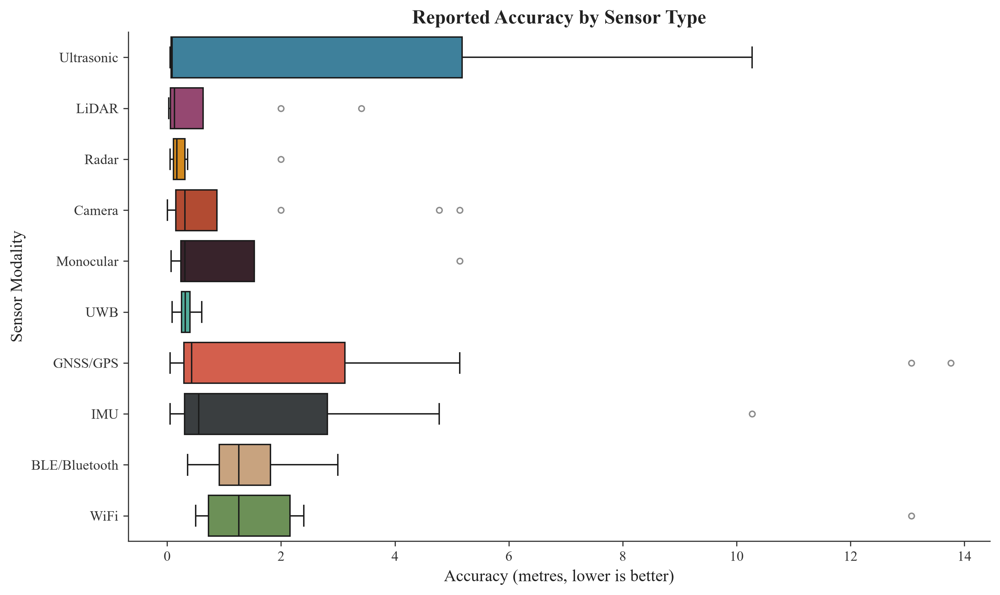

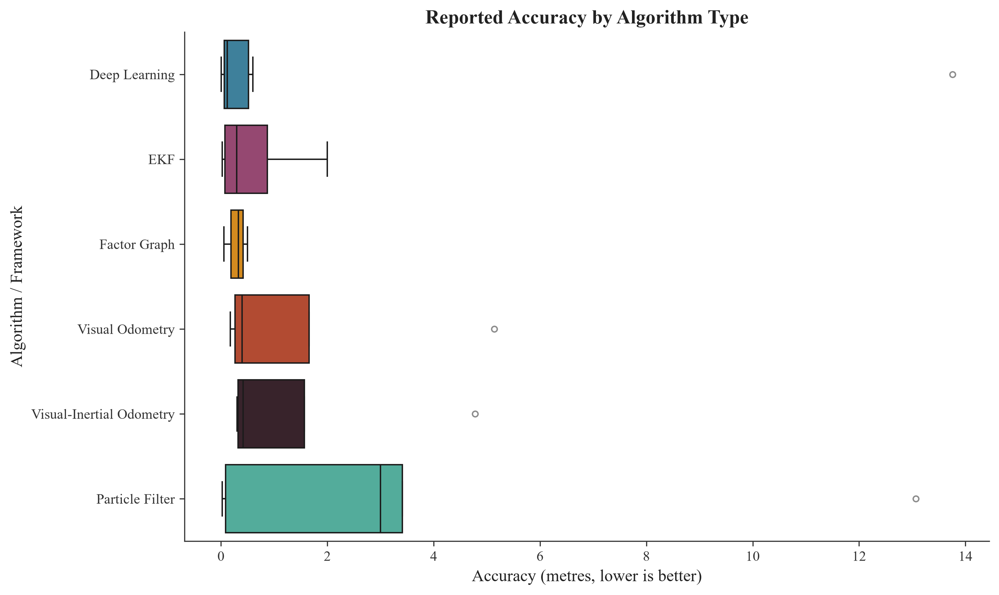

## 7. Application Domain Analysis (RQ4)

| Application | Count | Percentage |
|-------------|-------|------------|
| Generic/Other | 394 | 39.6% |
| Spacecraft | 235 | 23.6% |
| Multi-Robot/Swarm | 165 | 16.6% |
| UAV/Drone | 129 | 13.0% |
| UGV | 111 | 11.2% |
| Inspection | 84 | 8.4% |
| Pedestrian/PDR | 54 | 5.4% |
| Autonomous Car | 35 | 3.5% |
| AUV/Underwater | 33 | 3.3% |
| Search & Rescue | 31 | 3.1% |
| Indoor Robot | 21 | 2.1% |
| Agricultural | 6 | 0.6% |

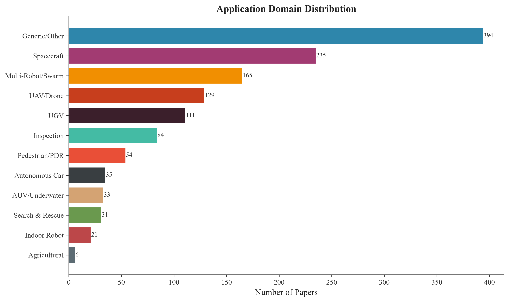

## 8. Evaluation Environment Analysis (RQ4)

| Environment | Count | Percentage |
|-------------|-------|------------|
| Indoor | 281 | 28.2% |
| Simulation | 197 | 19.8% |
| Real-World | 184 | 18.5% |
| Outdoor | 150 | 15.1% |
| Urban | 118 | 11.9% |
| Underwater | 34 | 3.4% |
| Tunnel/Underground | 23 | 2.3% |
| Forest/Vegetation | 19 | 1.9% |

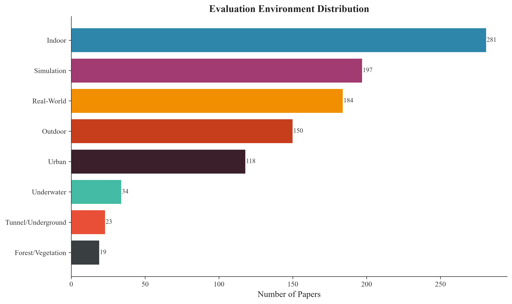

## 9. Benchmark Datasets & Publication Venues (RQ5)

### Benchmark Datasets

| Dataset | Count |
|---------|-------|
| KITTI | 44 |
| Custom/Own | 23 |
| EuRoC | 17 |
| TUM | 8 |
| MulRan | 3 |
| Oxford RobotCar | 3 |
| KAIST | 2 |
| Newer College | 2 |
| OpenLORIS | 1 |
| NCLT | 1 |

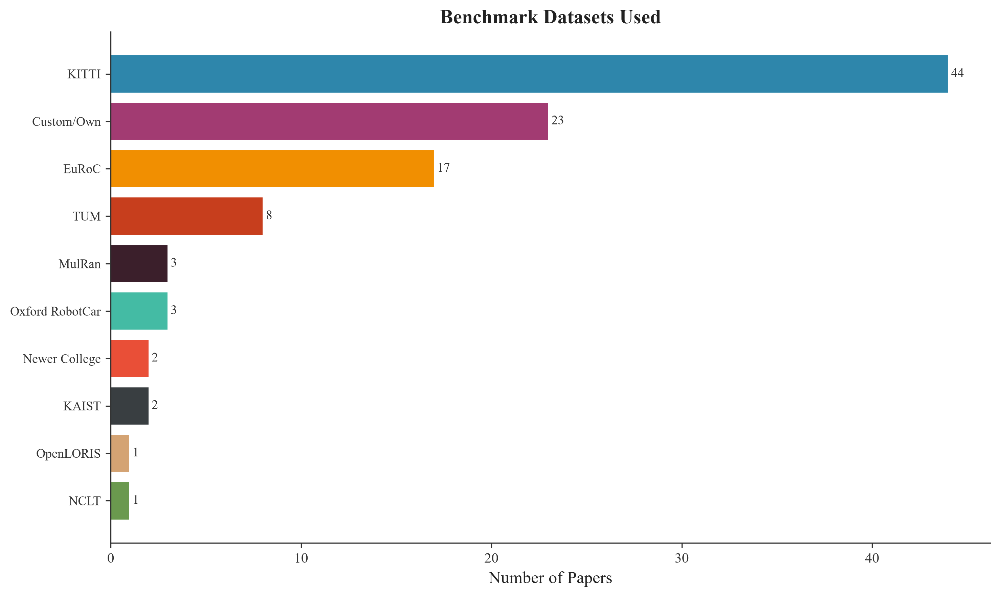

### Top 15 Publication Venues

| Venue | Papers |
|-------|--------|
| IEEE Transactions on Instrumentation and Measurement | 56 |
| IEEE Robotics and Automation Letters | 43 |
| IEEE Sensors Journal | 41 |
| IEEE Access | 41 |
| IEEE Internet of Things Journal | 25 |
| IEEE Transactions on Intelligent Transportation Systems | 20 |
| IEEE Transactions on Robotics | 15 |
| IEEE Transactions on Industrial Electronics | 13 |
| IEEE Transactions on Mobile Computing | 10 |
| IEEE Transactions on Vehicular Technology | 8 |
| IEEE Transactions on Industrial Informatics | 8 |
| IEEE/ASME Transactions on Mechatronics | 8 |
| IEEE Communications Letters | 6 |
| IEEE Transactions on Intelligent Vehicles | 6 |
| 2025 IEEE/RSJ International Conference on Intelligent Robots and Systems (IROS) | 5 |

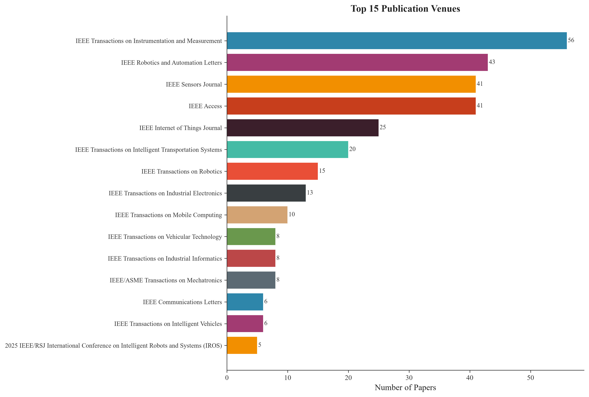

## 10. Most Cited Papers

| Rank | Title | Year | Citations |
|------|-------|------|-----------|
| 1 | Power System Dynamic State Estimation: Motivations, Definitions, Methodologies, ... | 2019 | 682 |
| 2 | A Survey of Enabling Technologies for Network Localization, Tracking, and Naviga... | 2018 | 412 |
| 3 | A Benchmark Comparison of Monocular Visual-Inertial Odometry Algorithms for Flyi... | 2018 | 313 |
| 4 | Deep Auxiliary Learning for Visual Localization and Odometry | 2018 | 205 |
| 5 | Assistant Vehicle Localization Based on Three Collaborative Base Stations via SB... | 2019 | 204 |
| 6 | A Survey on Odometry for Autonomous Navigation Systems | 2019 | 187 |
| 7 | A Survey on Indoor Vehicle Localization Through RFID Technology | 2021 | 174 |
| 8 | A Localization Based on Unscented Kalman Filter and Particle Filter Localization... | 2020 | 162 |
| 9 | SemanticSLAM: Using Environment Landmarks for Unsupervised Indoor Localization | 2016 | 161 |
| 10 | Design of an UWB indoor-positioning system for UAV navigation in GNSS-denied env... | 2015 | 156 |

## 11. Key Findings & Answers to Research Questions

### RQ1: Sensor Modalities
- The three most prevalent sensor modalities are **Camera** (402), **IMU** (333), and **GNSS/GPS** (321).
- 18 distinct sensor categories were identified across 776 papers.

### RQ2: Algorithms & Frameworks
- The three most adopted algorithms are **Visual-Inertial Odometry** (139), **Visual Odometry** (128), and **EKF** (119).

### RQ3: Localization Accuracy
- Accuracy values were extractable from 41 papers.
- Median reported accuracy: **0.360 m**.
- Best reported accuracy: **0.0050 m** (0.50 cm).

### RQ4: Evaluation Environments
- Most papers evaluate in **Indoor** environments (281 papers).

### RQ5: Datasets & Venues
- The most referenced benchmark dataset is **KITTI** (44 papers).
- The top publication venue is **IEEE Transactions on Instrumentation and Measurement** (56 papers).

### RQ6: Best Sensor–Algorithm Combination
- Based on frequency analysis, the most common combination is **GNSS/GPS + nan** (152 papers).
- Top 3 combinations: GNSS/GPS+nan (152), nan+nan (148), Camera+Visual-Inertial Odometry (138).

---

*This report was automatically generated by the GNSS-Denied Localization SLR Pipeline.*
*Generated on 2026-07-12 at 16:59*