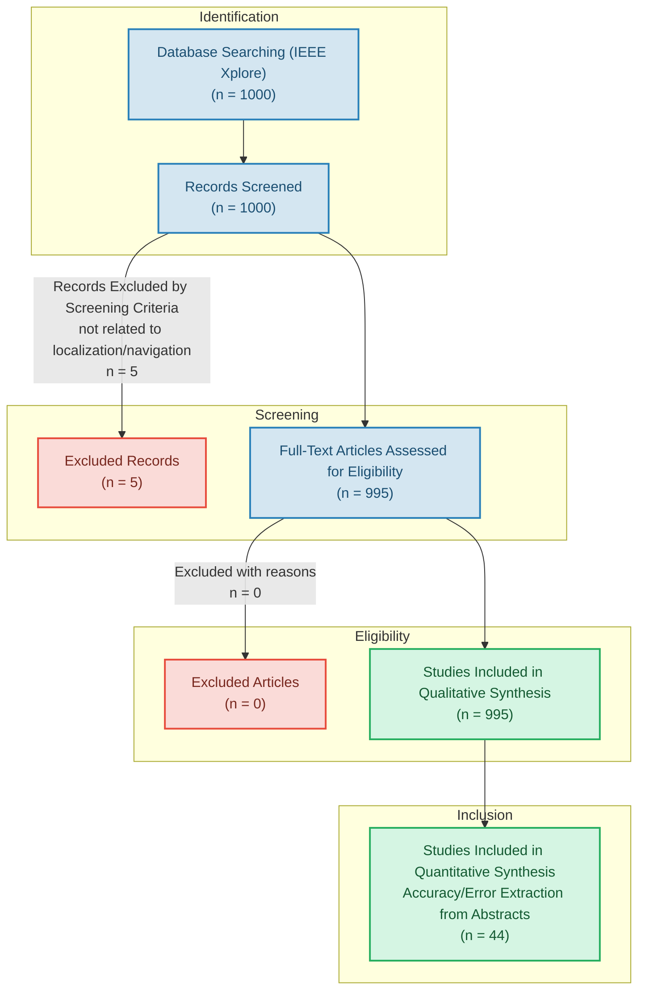

# PRISMA 2020 Flow Diagram

This flow diagram illustrates the systematic selection and screening process of literature for the GNSS-Denied Localization Systematic Literature Review, in accordance with the PRISMA (Preferred Reporting Items for Systematic Reviews and Meta-Analyses) guidelines.

## Detailed Counts at Each Phase

1. **Identification**:
   - Source: IEEE Xplore database export.
   - Search Query: `("GPS-denied" OR "GNSS-denied" OR "GPS denied" OR "GNSS denied") AND ("UAV" OR "drone" OR "quadrotor" OR "MAV" OR "unmanned aerial") AND ("navigation" OR "localization" OR "SLAM" OR "odometry" OR "state estimation")`
   - Total records exported: **1,000**

2. **Screening**:
   - Initial check: empty titles/abstracts check (0 dropped), publication year check 2015-2026 (0 dropped), duplicates check (0 dropped).
   - Text-corpus screening: keeping only papers matching key localization/navigation terms.
   - **5** papers were excluded because their titles, abstracts, and keywords did not contain explicit terms related to state estimation, localization, SLAM, odometry, or navigation (focusing instead purely on wireless communication protocols or hardware-level radio frequency modeling with no localization context).
   - Remaining papers: **995**

3. **Eligibility**:
   - **995** papers were eligible for classification and qualitative synthesis.
   - Classification categories:
     - Sensor modalities (Camera, IMU, Radar, LiDAR, etc.)
     - Algorithms/frameworks (VIO, VO, EKF, Deep Learning, etc.)
     - Application domains (UAV/Drone, UGV, Spacecraft, etc.)
     - Evaluation environments (Indoor, Outdoor, Simulation, Real-World)
     - Benchmark datasets (KITTI, EuRoC, TUM, etc.)

4. **Inclusion**:
   - **995** papers are included in the qualitative synthesis.
   - **44** papers contain quantitative accuracy/error metrics explicitly in their abstracts (e.g., ATE, RMSE, position error) and are included in the quantitative accuracy meta-analysis.
